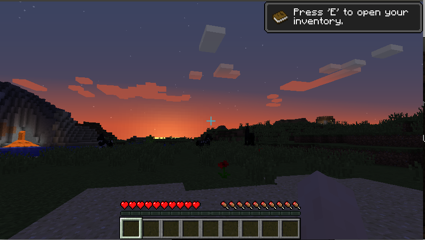
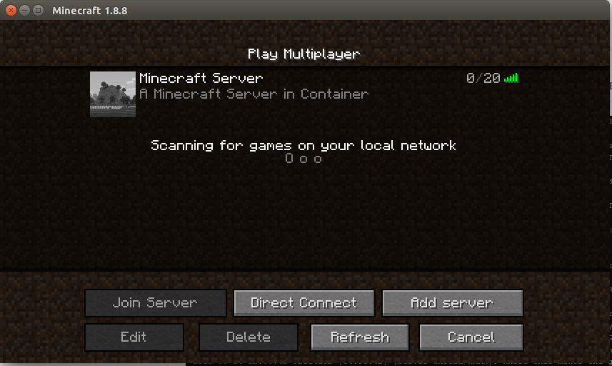

# 《我的世界》服务器 Docker 构建源

**先来一张 Minecraft 里的日落**

## 贡献一个我自己的

**mc8-longtian.myalauda.cn:59291**

## 服务器配置文件

- 自定义配置在 server.properties 这个文件里，启动的时候这个文件如果不存在的化会被自动创建，并且写入 Minecraft 的默认配置
- 修改了 `online-mode=false`, 适合想体验联机但是没有 minecraft 的账号的玩家。
- 默认同意 [ELUA](https://account.mojang.com/documents/minecraft_eula)

## 为什不用环境变量

环境变量对 Docker 还是很友好的，但是反编译 minecraft-server-*.jar 发现这货根本没有从环境变量中读取配置 (getenv,getProperties)，只能修改配置文件。 

## 参考文章

**配置文件详解（注意对应版本）**

[配置](http://minecraft.gamepedia.com/Server.properties)

[配置-zh](http://minecraft-zh.gamepedia.com/index.php?title=Server.properties&variant=zh)

**其它关于如何搭建的文章**

[搭建完全手册](https://www.maketecheasier.com/complete-guide-to-running-a-minecraft-server/)

[CB](http://www.christopherbiscardi.com/2014/12/27/deploying-a-minecraft-server-with-docker-machine/)

**Mincecraft 服务器管理工具**

[Server Manager](http://msmhq.com/)

[Server Admin](https://www.npmjs.com/package/minecraft-server-admin)

**Java 反编译的工具**

[Java Decompiler](http://jd.benow.ca/)

## 更新历史

v1.8.8 2015-09-16